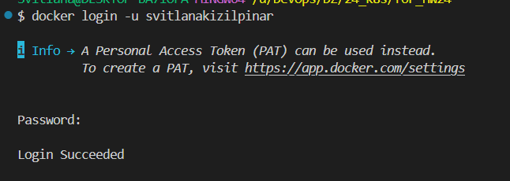
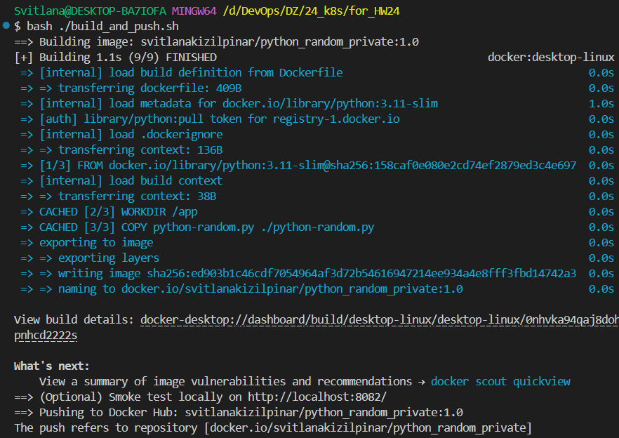
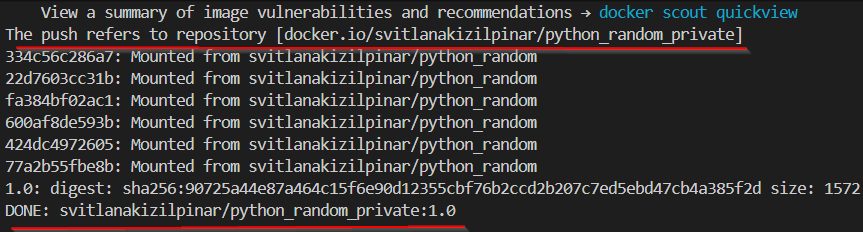
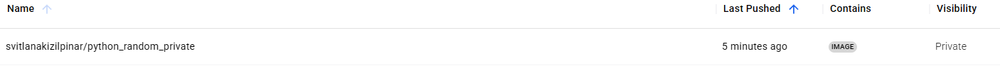

# HW24 — Docker: clone → build → push

## 1) Клонування репозиторію з GitLab

> Важливо: посилання типу `.../-/tree/...` — це папка в репо. Потрібно клонувати **весь** репозиторій.

```bash
git clone git@gitlab.com:dan-it/groups/devops_soft.git
cd devops_soft/for_HW24
```

У цьому ДЗ код скрипта знаходиться у файлі `python-random.py`.

## 2) Створення приватного репозиторію в Docker Hub

1) Відкрити Docker Hub: https://hub.docker.com

2) Створити репозиторій:
- Натиснути **Create repository**
- **Name**: `python_random_private` (або інша назва, але тоді потрібно змінити `IMAGE_REPO` у скрипті)
- **Visibility**: **Private**

3) (Рекомендовано) Створити **Personal Access Token (PAT)**:
- Docker Hub → **Account Settings** → **Security** → **New Access Token**
- Права: `Read/Write` достатньо для `docker push`

## 3) Dockerfile

Dockerfile для скрипта вже створений у папці `for_HW24/`.

Що робить контейнер:
- запускає `python-random.py`
- відкриває порт `8082`
- HTTP-відповідь доступна по `GET /`

## 4) Збірка Docker-образу (build)

Основний варіант — через bash-скрипт (він робить і `docker build`, і `docker push`).

Запускати команди з папки `for_HW24`:

```bash
cd for_HW24

docker logout
docker login -u svitlanakizilpinar
bash ./build_and_push.sh
```

> Репозиторій у Docker Hub має бути **Private**. Для `docker login` використовуйте **Personal Access Token (PAT)** як пароль (особливо якщо ввімкнений 2FA).

## 5) Які команди виконує скрипт (довідково)

Скрипт `build_and_push.sh` під капотом виконує приблизно такі команди:

```bash
docker build -t svitlanakizilpinar/python_random_private:1.0 .
docker push svitlanakizilpinar/python_random_private:1.0
```

## 6) Локальна перевірка (опціонально)

Після білду можна перевірити контейнер локально:

```bash
docker run --rm -p 8082:8082 svitlanakizilpinar/python_random_private:1.0
```

В іншому терміналі:

```bash
curl http://localhost:8082/
```

## 7) Пуш у приватний Docker Hub репозиторій (якщо без скрипта)

Якщо пуш робити вручну (без `build_and_push.sh`), тоді:

```bash
docker logout
docker login -u svitlanakizilpinar
docker push svitlanakizilpinar/python_random_private:1.0
```

## 8) Альтернатива: ручний build (якщо без скрипта)

Якщо збірку робити вручну (без `build_and_push.sh`), тоді:

```bash
docker build -t svitlanakizilpinar/python_random_private:1.0 .
```

> Якщо ввімкнений 2FA, потрібно використовувати **Personal Access Token** (PAT) замість пароля.

## 9) Скріншоти (папка screens)

### `docker login` (через PAT, якщо 2FA увімкнено):
 

### Успішний `docker build`:


### Успішний `docker push`:


### Docker Hub репозиторій з **Visibility: Private** і тегом образу:

