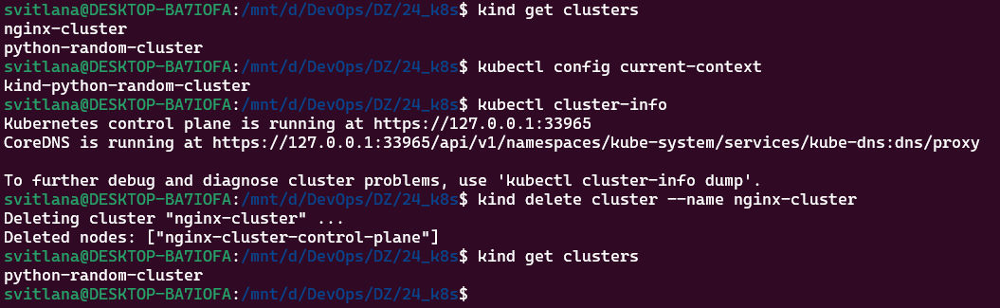
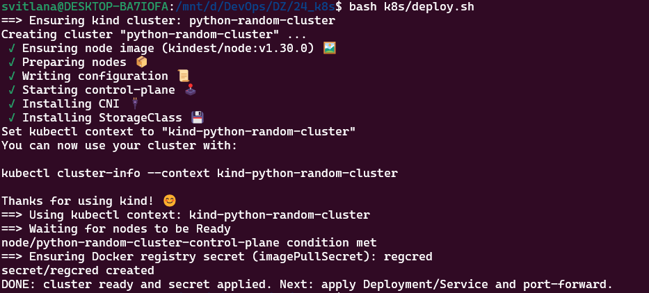
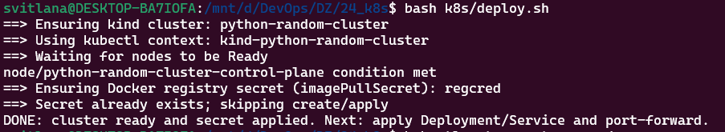
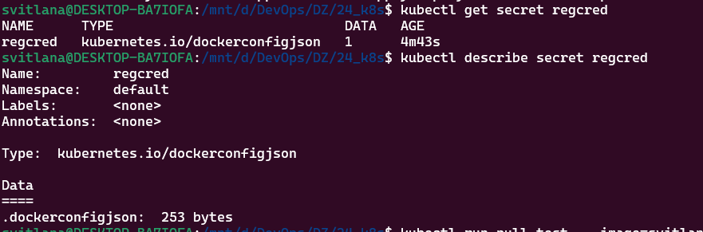
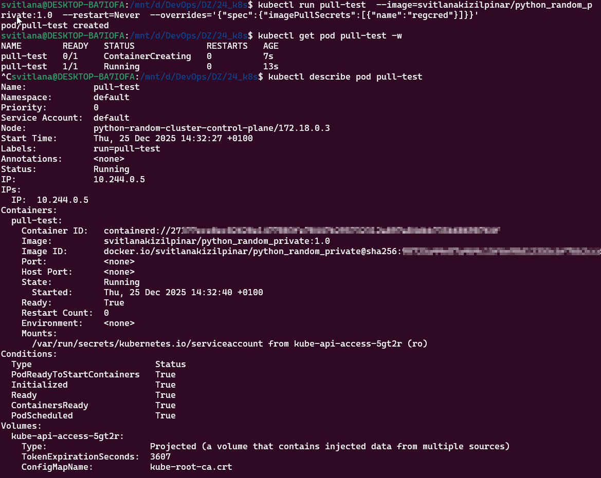

# HW24 — Kubernetes (kind): Cluster + Secret (через k8s/deploy.sh)

Цей файл — коротка інструкція **тільки** для скрипта [k8s/deploy.sh](../k8s/deploy.sh): він створює kind-кластер, перемикає контекст, створює `imagePullSecret` для приватного Docker Hub образу і застосовує Deployment/Service.

## 1) Підготовка (.env)

У WSL (Ubuntu) відкрити проект:

```bash
cd /mnt/d/DevOps/DZ/24_k8s
```

Створити файл з секретами (не комітиться):

```bash
cp k8s/.env.example k8s/.env
```

Відредагувати `k8s/.env` і заповнити:
- `DOCKERHUB_EMAIL`
- `DOCKERHUB_PAT` (Docker Hub Personal Access Token)

## 2) Запуск (кластер + secret)

```bash
bash k8s/deploy.sh
```

Що робить скрипт:
- створює kind-кластер `python-random-cluster` (якщо його ще немає) за конфігом `k8s/kind-config.yaml`
- перемикає контекст на `kind-python-random-cluster`
- чекає `Ready` для nodes
- створює secret `regcred` (якщо його ще немає), генеруючи YAML у `k8s/dockerhub-secret.yaml` і застосовує його
- застосовує [k8s/deployment.yaml](k8s/deployment.yaml) і [k8s/service.yaml](k8s/service.yaml)

Повторний запуск:
- якщо `regcred` вже існує → скрипт **не** перегенеровує `k8s/dockerhub-secret.yaml`

## 3) Перевірки

Перевірити, що кластер створився і активний потрібний контекст:

```bash
kind get clusters
kubectl config current-context
kubectl cluster-info
```

```bash
kubectl get nodes -o wide
kubectl get secret regcred
kubectl describe secret regcred
```

Додаткова перевірка (на 100% показує, що приватний image стягується через secret `regcred`):

```bash
kubectl run pull-test \
	--image=svitlanakizilpinar/python_random_private:1.0 \
	--restart=Never \
	--overrides='{"spec":{"imagePullSecrets":[{"name":"regcred"}]}}'

kubectl get pod pull-test -w
kubectl delete pod pull-test
```

## 4) Якщо треба оновити токен (перегенерувати secret)

```bash
kubectl delete secret regcred
bash k8s/deploy.sh
```

## 5) Як видалити кластер (якщо треба)

```bash
kind delete cluster --name python-random-cluster
```

Перевірка, що його більше немає:

```bash
kind get clusters
```

## 6) Скріншоти (папка screens)

### Перевірка кластера: `kind get clusters`, `kubectl cluster-info` (і приклад видалення зайвого кластера):


### Перший запуск `bash k8s/deploy.sh` (створення кластера + secret):


### Повторний запуск (secret вже існує):


### Перевірка `kubectl get/describe secret regcred`:


### `pull-test` успішно стягує приватний image

