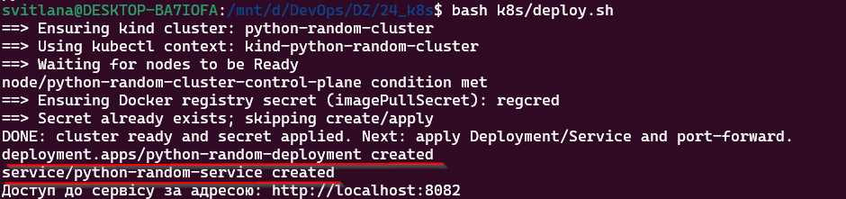

# HW24 — Kubernetes: Deployment + Service + перевірки

Цей файл описує розгортання застосунку через маніфести:
- [k8s/deployment.yaml](../k8s/deployment.yaml)
- [k8s/service.yaml](../k8s/service.yaml)

## 1) Застосувати маніфести

У WSL (Ubuntu):

```bash
cd /mnt/d/DevOps/DZ/24_k8s

# Цей скрипт:
# - створює kind cluster (якщо немає)
# - створює/перевіряє regcred (imagePullSecret)
# - застосовує Deployment + Service
bash k8s/deploy.sh
```

## 2) Перевірити, що все піднялось

```bash
kubectl get deploy,po,svc -o wide
kubectl rollout status deploy/python-random-deployment
kubectl get endpoints python-random-service -o wide
```

Очікувано:
- `deployment` має бути `3/3`
- `pods` у статусі `Running`
- `service` має `ClusterIP`
- `endpoints` має стільки адрес, скільки pod-ів

## 3) Перевірка через port-forward (curl + браузер)

Термінал 1:

```bash
kubectl port-forward svc/python-random-service 8082:8082
```

Термінал 2 (curl):

```bash
curl http://localhost:8082/
```

Браузер:
- Відкрити `http://localhost:8082/`

## 4) Доказ, що Service розподіляє трафік між різними pod-ами

Найнадійніше це показати запитами **зсередини кластера** і паралельними логами.

Термінал 1 (показує, який pod обробив запит):

```bash
kubectl logs -l app=python-random --tail=0 -f --prefix
```

Термінал 2 (створює тимчасовий pod з curl і робить багато запитів у Service):

```bash
kubectl run curl --rm -it --restart=Never --image=curlimages/curl -- sh
```

Всередині `sh`:

```sh
for i in $(seq 1 30); do curl -s http://python-random-service:8082/; echo; done
```

Очікувано:
- у логах в терміналі 1 будуть рядки з **різними pod names**
- у відповідях `curl` зазвичай буде видно 2–3 різних значення (бо кожен pod генерує свій random при старті контейнера)

## 5) Скріншоти (папка screens)

### Застосування Deployment/Service (через `bash k8s/deploy.sh` або `kubectl apply`):


### `kubectl get deploy,pods,svc -o wide`


### `kubectl port-forward svc/python-random-service 8082:8082`


### Результат `curl http://localhost:8082/`:


### Результат у браузері `http://localhost:8082/`


### Доказ балансування: паралельно `kubectl logs ... --prefix` і `kubectl run curl ...`
 
